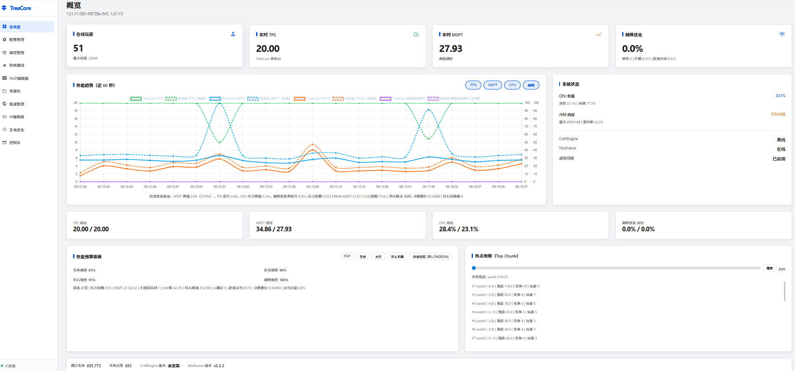
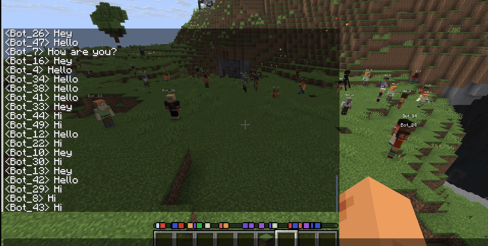
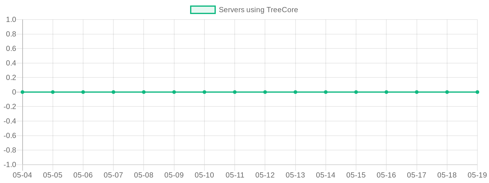
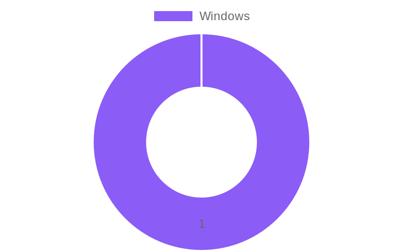
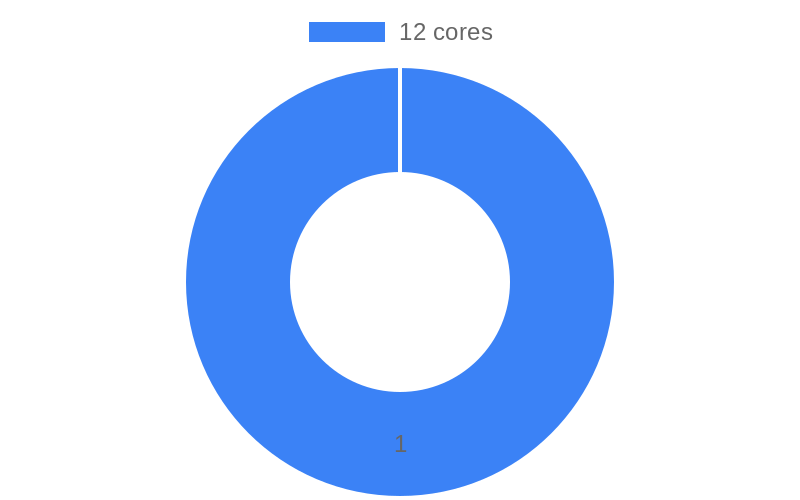

<div align="center">



<h1>TreeCore / Tree</h1>

<p><strong>高性能 Minecraft 服务端核心 | 基于 Paper 1.21.x 深度优化</strong></p>

<p><em>以树根的稳定性承载底座，以树干的承压力应对高并发，以树冠的扩展性连接插件生态</em></p>

<p>
  <a href="https://github.com/TreeMC-cloud/Tree/stargazers"></a>
  <a href="https://github.com/TreeMC-cloud/Tree/network/members"></a>
  <a href="https://github.com/TreeMC-cloud/Tree/commits/main"></a>
  <a href="https://papermc.io"></a>
  <a href="https://adoptium.net"></a>
  <a href="./LICENSE"></a>
  <a href="https://bstats.org/plugin/server-implementation/TreeCore"></a>
</p>

<p>
  <strong><a href="#快速开始">快速开始</a></strong> ·
  <strong><a href="#核心功能">功能概览</a></strong> ·
  <strong><a href="#为什么选择-treecore">性能对比</a></strong> ·
  <strong><a href="#游戏内命令">命令参考</a></strong> ·
  <strong><a href="#web-管理面板">Web 面板</a></strong> ·
  <strong><a href="./SECURITY.md">安全策略</a></strong> ·
  <strong><a href="./CONTRIBUTING.md">贡献指南</a></strong> ·
  <strong><a href="#反馈与交流">QQ 群: 910574536</a></strong>
</p>

</div>

---

## 仓库说明

> 这是 **Tree 的公开说明仓库**，用于向使用者展示功能、文档、截图、安装方法与更新信息。
>
> - 你现在看到的是：**公开可浏览内容**
> - 团队日常开发维护的是：**私有源码仓库 `Tree-private`**
> - 如果你只是想了解、部署、对比和查看文档，这个仓库就够用了

### 这里能看到什么？

- 完整功能介绍与性能对比
- 安装方式、命令说明、Web 面板说明
- 实机截图、GIF 演示与 bStats 统计
- 安全策略、贡献说明与后续更新信息

### 如果你是使用者

建议按这个阅读顺序开始：

1. **快速开始**：先把服务端跑起来
2. **核心功能**：确认它适不适合你的服
3. **Web 管理面板**：了解可视化管理能力
4. **游戏内命令**：掌握日常运维入口

---

## 实测预览

<table>
<tr>
<td width="50%">

**51 人实时游戏测试**


</td>
<td width="50%">

**Web 控制台面板**


</td>
</tr>
</table>

> 以上截图来自 TreeCore 实际运行服务器，51 名玩家同时在线，TPS 稳定 20.0

### 使用统计

<div align="center">

[](https://bstats.org/plugin/server-implementation/TreeCore)

<!-- BSTATS-STATS-START -->
| 指标 | 数值 |
|:---:|:---:|
| 服务器数量 |  |
| 操作系统 | Windows (1) |
| CPU 核心数 | 12 (1) |
| 服务器地区 | Japan (1) |



<table><tr>
<td></td>
<td></td>
</tr></table>

**[查看完整统计图表 →](https://bstats.org/plugin/server-implementation/TreeCore)**

<sub>数据每 6 小时通过 bStats API 自动更新 · 最近更新: 2026-03-06 14:06 UTC</sub>
<!-- BSTATS-STATS-END -->

</div>

> TreeCore 通过 [bStats](https://bstats.org/) 收集匿名使用统计（服务器数量、在线玩家数、Minecraft 版本等），帮助我们了解使用情况。你可以在 `plugins/bStats/config.yml` 中关闭。

---

## 为什么选择 TreeCore

### 与主流服务端核心的完整对比

<table>
<tr>
<th align="left" width="220">能力维度</th>
<th align="center" width="130">Paper</th>
<th align="center" width="130">Purpur</th>
<th align="center" width="130">Pufferfish</th>
<th align="center" width="180"><b>TreeCore</b> ✅</th>
</tr>
<tr><td colspan="5"><b>性能优化</b></td></tr>
<tr>
<td>动态视距调整</td>
<td align="center">❌ 手动改配置</td>
<td align="center">❌ 手动改配置</td>
<td align="center">❌ 手动改配置</td>
<td align="center"><b>✅ 自动 2~10 档</b></td>
</tr>
<tr>
<td>动态模拟距离</td>
<td align="center">❌</td>
<td align="center">❌</td>
<td align="center">❌</td>
<td align="center"><b>✅ 自动 2~10 档</b></td>
</tr>
<tr>
<td>Paper 配置实时调参</td>
<td align="center">❌ 手动 + 重启</td>
<td align="center">❌ 手动 + 重启</td>
<td align="center">❌ 手动 + 重启</td>
<td align="center"><b>✅ 14 项参数热调</b></td>
</tr>
<tr>
<td>自动分层预设</td>
<td align="center">❌</td>
<td align="center">❌</td>
<td align="center">❌</td>
<td align="center"><b>✅ 4 档自动切换</b></td>
</tr>
<tr>
<td>MSPT 响应式收紧</td>
<td align="center">❌</td>
<td align="center">❌</td>
<td align="center">❌</td>
<td align="center"><b>✅ MSPT>45ms 触发</b></td>
</tr>
<tr>
<td>动态网络压缩</td>
<td align="center">❌ 静态阈值</td>
<td align="center">❌ 静态阈值</td>
<td align="center">❌ 静态阈值</td>
<td align="center"><b>✅ 按玩家数自适应</b></td>
</tr>
<tr>
<td>区块预生成</td>
<td align="center">❌ 需装 Chunky</td>
<td align="center">❌ 需装 Chunky</td>
<td align="center">❌ 需装 Chunky</td>
<td align="center"><b>✅ 方向预测 + 异步</b></td>
</tr>
<tr>
<td>自动低谷 GC</td>
<td align="center">❌</td>
<td align="center">❌</td>
<td align="center">❌</td>
<td align="center"><b>✅ 智能触发时机</b></td>
</tr>
<tr>
<td>Tick 平滑 / 恢复</td>
<td align="center">❌</td>
<td align="center">❌</td>
<td align="center">❌</td>
<td align="center"><b>✅ 自动检测恢复</b></td>
</tr>
<tr>
<td>fastutil 原始集合</td>
<td align="center">部分</td>
<td align="center">部分</td>
<td align="center">部分</td>
<td align="center"><b>✅ 热路径全覆盖</b></td>
</tr>
<tr>
<td>对象池 (BlockPos/Vec3)</td>
<td align="center">❌</td>
<td align="center">❌</td>
<td align="center">❌</td>
<td align="center"><b>✅ 池化复用</b></td>
</tr>
<tr>
<td>多核并行优化</td>
<td align="center">❌ 单线程</td>
<td align="center">❌ 单线程</td>
<td align="center">❌ 单线程</td>
<td align="center"><b>✅ 工作线程池 + 虚拟线程</b></td>
</tr>
<tr>
<td>碰撞检测节流</td>
<td align="center">❌</td>
<td align="center">❌</td>
<td align="center">❌</td>
<td align="center"><b>✅ MSPT 感知 O(n²) 优化</b></td>
</tr>
<tr>
<td>寻路缓存</td>
<td align="center">❌</td>
<td align="center">❌</td>
<td align="center">❌</td>
<td align="center"><b>✅ MSPT 感知 + 异步寻路</b></td>
</tr>
<tr>
<td>实体智能降频</td>
<td align="center">❌</td>
<td align="center">❌</td>
<td align="center">⚠️ DAB 修改 AI</td>
<td align="center"><b>✅ 保持原版 AI 行为</b></td>
</tr>
<tr><td colspan="5"><b>管理工具</b></td></tr>
<tr>
<td>Web 管理面板</td>
<td align="center">❌ 需第三方面板</td>
<td align="center">❌ 需第三方面板</td>
<td align="center">❌ 需第三方面板</td>
<td align="center"><b>✅ 内置 11 页面板</b></td>
</tr>
<tr>
<td>TPS/MSPT BossBar</td>
<td align="center">❌ 需装 Spark</td>
<td align="center">❌ 需装 Spark</td>
<td align="center">❌ 需装 Spark</td>
<td align="center"><b>✅ /tc tpsbar</b></td>
</tr>
<tr>
<td>JVM 参数自动生成</td>
<td align="center">❌ 需人工查阅</td>
<td align="center">❌ 需人工查阅</td>
<td align="center">❌ 需人工查阅</td>
<td align="center"><b>✅ /tc jvmflags</b></td>
</tr>
<tr>
<td>启动脚本自动生成</td>
<td align="center">❌</td>
<td align="center">❌</td>
<td align="center">❌</td>
<td align="center"><b>✅ /tc startscript</b></td>
</tr>
<tr>
<td>插件性能审计</td>
<td align="center">❌ 需装 Spark</td>
<td align="center">❌ 需装 Spark</td>
<td align="center">❌ 需装 Spark</td>
<td align="center"><b>✅ /tc audit</b></td>
</tr>
<tr>
<td>远程控制台 + 日志流</td>
<td align="center">❌ 需 RCON</td>
<td align="center">❌ 需 RCON</td>
<td align="center">❌ 需 RCON</td>
<td align="center"><b>✅ Web 实时</b></td>
</tr>
<tr>
<td>内存快照 / 线程 dump</td>
<td align="center">❌ 需 SSH</td>
<td align="center">❌ 需 SSH</td>
<td align="center">❌ 需 SSH</td>
<td align="center"><b>✅ Web 一键</b></td>
</tr>
<tr>
<td>备份管理</td>
<td align="center">❌ 需装插件</td>
<td align="center">❌ 需装插件</td>
<td align="center">❌ 需装插件</td>
<td align="center"><b>✅ 内置</b></td>
</tr>
<tr><td colspan="5"><b>游戏功能</b></td></tr>
<tr>
<td>假人系统 (Carpet 风格)</td>
<td align="center">❌ 需装 Carpet</td>
<td align="center">❌ 需装 Carpet</td>
<td align="center">❌ 需装 Carpet</td>
<td align="center"><b>✅ 内置完整系统</b></td>
</tr>
<tr>
<td>粒子特效编辑器</td>
<td align="center">❌</td>
<td align="center">❌</td>
<td align="center">❌</td>
<td align="center"><b>✅ 拖拽式画布</b></td>
</tr>
<tr>
<td>3D 模型管理</td>
<td align="center">❌ 需装插件</td>
<td align="center">❌ 需装插件</td>
<td align="center">❌ 需装插件</td>
<td align="center"><b>✅ 内置 + 资源包</b></td>
</tr>
<tr>
<td>CraftEngine 桥接</td>
<td align="center">❌</td>
<td align="center">❌</td>
<td align="center">❌</td>
<td align="center"><b>✅ 一键同步</b></td>
</tr>
<tr><td colspan="5"><b>原版兼容性</b></td></tr>
<tr>
<td>红石机制</td>
<td align="center">✅ 原版</td>
<td align="center">⚠️ 可选修改</td>
<td align="center">⚠️ 可选修改</td>
<td align="center"><b>✅ 完全原版速度</b></td>
</tr>
<tr>
<td>漏斗机制</td>
<td align="center">✅ 原版</td>
<td align="center">⚠️ 可选修改</td>
<td align="center">⚠️ 可选修改</td>
<td align="center"><b>✅ 完全原版速度</b></td>
</tr>
<tr>
<td>生物 AI 行为</td>
<td align="center">✅ 原版</td>
<td align="center">✅ 原版</td>
<td align="center">⚠️ DAB 会修改</td>
<td align="center"><b>✅ 完全原版</b></td>
</tr>
<tr>
<td>碰撞 / 伤害</td>
<td align="center">✅ 原版</td>
<td align="center">✅ 原版</td>
<td align="center">✅ 原版</td>
<td align="center"><b>✅ 完全原版</b></td>
</tr>
<tr>
<td>Paper 插件兼容</td>
<td align="center">✅</td>
<td align="center">✅</td>
<td align="center">✅</td>
<td align="center"><b>✅ 100%</b></td>
</tr>
</table>

### 核心差异总结

| | Paper / Purpur / Pufferfish | **TreeCore** |
|---|---|---|
| **优化方式** | 提供静态配置项，腐竹手动调参 + 重启生效 | **运行时自动调参，无需手动干预** |
| **CPU 利用** | 单线程 tick，多核 CPU 闲置 | **多核工作线程池 + Java 21 虚拟线程** |
| **人数应对** | 配置写死，高低峰同一套参数 | **4 档自动分层：30/60/150+ 人自动切换** |
| **高密度实体** | 无特殊优化（Pufferfish DAB 修改 AI） | **碰撞节流 + 寻路缓存 + 智能降频，保持原版** |
| **监控方式** | 需安装 Spark / Grafana 等外部工具 | **内置 Web 面板 + BossBar + `/tps` 一屏全览** |
| **学习门槛** | 需理解 Paper/Spigot 几十项配置含义 | **开箱即用，所有优化默认启用** |
| **生电支持** | 需安装 Carpet mod 或第三方假人插件 | **内置假人系统 + Web 管理** |
| **游戏影响** | Pufferfish DAB 会修改远处 AI 行为 | **所有机制保持完全原版** |

---

## 核心功能

### 性能优化引擎

TreeCore 的核心设计原则：**所有优化对玩家完全不可见，所有游戏机制保持原版行为**。

<details>
<summary><b>动态视距 / 模拟距离</b></summary>

根据实时 TPS、MSPT 和玩家数量自动调整视距和模拟距离：
- 压力低时自动扩大到最大视距（默认 10），体验更好
- 压力高时逐步收紧到最小视距（默认 3），保护 TPS
- 带滞回机制，避免频繁波动
- 可配置最小/最大范围、调整步长、冷却时间

</details>

<details>
<summary><b>Paper 配置自动调优（14 项热调参数）</b></summary>

TreeCore 内置 `PaperConfigTuner`，根据当前负载实时调整 Paper/Spigot 配置，**无需重启**：

| 调优参数 | 说明 |
|---|---|
| `monster-spawn-range` | 怪物生成范围 |
| `entity-activation-range` (怪物/动物/杂项) | EAR 激活距离 |
| `mob-spawn-limits` (怪物/动物/水生/环境) | 各类生物生成上限 |
| `merge-radius.item` / `merge-radius.exp` | 物品/经验球合并半径 |
| `tick-inactive-villagers` | 非活跃村民 tick 频率 |
| `entity-tracking-range` | 实体追踪范围 |
| `max-auto-save-chunks-per-tick` | 自动存盘速率 |
| `network-compression-threshold` | 动态网络压缩阈值 |

所有参数通过 Paper/Spigot 原生 API 在运行时修改，无侵入、无副作用。

</details>

<details>
<summary><b>4 档自动分层预设</b></summary>

根据在线人数自动切换配置档位：

| 档位 | 触发条件 | EAR 怪物/动物 | 生成上限 | 物品合并 | 视距范围 |
|---|---|---|---|---|---|
| **SURVIVAL** | ≤30 人 | 32 / 32 | 70 / 10 | 2.5 格 | 最大 10 |
| **LONGRUN** | 30~60 人 | 28 / 24 | 50 / 8 | 3.5 格 | 最大 8 |
| **LOBBY** | 60~150 人 | 24 / 16 | 35 / 6 | 4.0 格 | 最大 7 |
| **EXTREME** | 150+ 人 | 20 / 10 | 20 / 4 | 5.0 格 | 最大 5 |

还支持 MSPT 自动升级：当 MSPT 持续超限时自动升档，即使人数未达阈值。

</details>

<details>
<summary><b>动态网络压缩</b></summary>

- 玩家 ≤ 30 人：压缩阈值 512（节省 CPU）
- 玩家 30~80 人：压缩阈值 256
- 玩家 80+ 人：压缩阈值 128（节省带宽）
- 通过 Paper API 运行时调整，无需重启

</details>

<details>
<summary><b>多核并行优化</b></summary>

TreeCore 充分利用多核 CPU，在保证线程安全的前提下将计算任务分散到多个核心：

- **工作线程池** — 自动按 CPU 核心数分配 2~4 个工作线程，处理排序、聚合、Component 构建等纯计算任务
- **Java 21 虚拟线程** — Web 操作、资源包构建、插件 IO 全部使用虚拟线程，不阻塞主线程
- **异步寻路** — 复杂寻路计算可选异步化，结果通过 O(1) 队列回传主线程
- **异步区块预载** — 检测玩家移动方向，异步预加载前方区块
- **并发安全审计** — 所有跨线程数据使用 `ConcurrentHashMap`、`AtomicInteger`、`volatile`、`ClassValue` 等正确的并发原语

</details>

<details>
<summary><b>实体高密度优化</b></summary>

针对实体数量巨大（1000+）时的性能瓶颈，TreeCore 提供多层优化：

- **碰撞检测节流** — 对密集实体群的 O(n²) 碰撞检测按 MSPT 压力智能降频，不影响 AI 和战斗
- **寻路缓存** — MSPT 感知的寻路结果缓存，失败寻路自动延长重试间隔
- **实体类型感知降频** — 按 `HOSTILE/PASSIVE/AMBIENT/ITEM/DECORATION/PROJECTILE` 六级优先级智能调频
- **漏斗 MSPT 感知节流** — 根据实时 MSPT 动态调整漏斗检查频率
- **所有优化保持原版 AI** — 与 Pufferfish DAB 不同，TreeCore 不修改任何 AI 行为

</details>

<details>
<summary><b>更多优化特性</b></summary>

- **区块预生成** — 检测玩家移动方向，异步预加载前方区块，消除卡顿感
- **自动低谷 GC** — 仅在 ≤5 人 + TPS ≥ 19.5 + 堆使用率 > 60% 时主动触发 System.gc()
- **Tick 平滑** — 检测超时 tick 并标记恢复状态，防止连锁卡顿
- **fastutil 原始集合** — 热路径使用 `Long2ObjectOpenHashMap` 等原始类型集合，消除自动装箱
- **对象池** — `BlockPos.MutableBlockPos` / `Vec3` 数组池化复用，减少 GC 压力
- **漏斗满容器节流** — 目标容器满时自动减少空转检查频率

</details>

### 原版特性保护

TreeCore 的所有优化都不会修改任何游戏机制。这是与 Pufferfish 等核心的根本区别：

| 游戏机制 | TreeCore 状态 | 说明 |
|---|---|---|
| 红石电路 | ✅ **完全原版速度** | 不做任何限流或跳过 |
| 漏斗传输 | ✅ **完全原版速度** | 不做任何限流或跳过 |
| 生物 AI | ✅ **完全原版** | 所有距离内 AI 行为不变 |
| 实体物理 | ✅ **完全原版** | 碰撞、伤害、速度全部不变 |
| TNT / 地毯复制 | ✅ **可选启用** | 内置 Carpet 风格开关 |

---

## Web 管理面板

TreeCore 内置一个功能完整的 Web 管理面板（亮/暗双主题），启动后访问 `http://localhost:8080`：

| 页面 | 功能 |
|---|---|
| **仪表盘** | TPS / MSPT / CPU / 内存实时监控，性能趋势图表（40 数据点），JVM 内存条、CPU 负载条，性能范围对比，当前/峰值数据 |
| **控制台** | 远程执行命令，实时日志流（彩色分级），日志过滤（INFO/WARN/ERROR + 关键字），自动滚动 |
| **诊断工具** | JVM 内存快照（堆 + 内存池明细），卡顿检测（主线程阻塞检测），线程转储（一键生成 + 复制） |
| **核心配置** | 可视化编辑所有 TreeCore 参数（60+ 项），配置搜索过滤，分组折叠，高级模式（原始 JSON） |
| **生电优化** | 红石优化开关（热点限流/回放），假人系统管理（创建/移除/皮肤），TNT/地毯复制开关 |
| **模型管理** | 拖拽上传 3D 模型文件，模型列表管理，一键生成资源包 |
| **资源包** | 本地托管 / 外部 URL，CraftEngine 同步桥，主题编辑器 |
| **粒子特效** | 多发射器拖拽式画布编辑器，预设特效（blizzard/nova/helix/ring），关键帧贝塞尔曲线编辑，实时预览播放 |
| **集成运维** | CraftEngine / Multiverse / ItemsAdder 状态监控，世界管理（创建/加载/卸载），一键发布 |
| **IA 编辑器** | ItemsAdder 菜单可视化编辑，槽位配置 |
| **备份管理** | 一键创建/恢复世界备份，备份列表（大小/时间） |

**面板特性：**
- 亮色 / 暗色主题一键切换（持久化）
- 移动端响应式布局（汉堡菜单）
- 键盘快捷键（1~9 切页、T 切主题、[ 折叠侧边栏、? 快捷键列表）
- 侧边栏可折叠（图标模式 + 悬浮提示）
- 数值变化动画（CountUp 缓动）
- Toast 通知系统（替代所有 alert）
- 按钮加载态 + 骨架屏
- 卡片入场 Stagger 动画 + 进度条光泽扫过
- Admin Token 认证

---

## 游戏内命令

所有命令前缀为 `/treecore`（别名 `/tc`），需权限 `treecore.admin`。

| 命令 | 功能 | 说明 |
|---|---|---|
| `/tps` | **TreeCore 状态面板** | TPS/MSPT/压力/多核线程/虚拟线程/异步任务/实体/区块/视距/寻路缓存/内存 一屏全览 |
| `/tc` | 显示帮助 | 列出所有可用子命令 |
| `/tc perf` | 性能报告 | 查看 TPS/MSPT/压力指数/视距/实体统计等完整运行状态 |
| `/tc perftest` | 性能压测 | 在随机区块生成大量混合实体，模拟百人服务器负载 |
| `/tc tpsbar` | TPS 监控条 | 在 BossBar 显示实时 TPS、MSPT、压力百分比、当前视距 |
| `/tc jvmflags` | JVM 参数建议 | 根据当前堆内存和最大玩家数生成优化 JVM 启动参数 |
| `/tc startscript` | 启动脚本生成 | 自动生成 `start.sh` + `start.bat`，含优化 JVM 参数 |
| `/tc tuner` | 调优器状态 | 查看 PaperConfigTuner 当前档位及各档位配置明细 |
| `/tc audit` | 插件审计 | 扫描所有插件的监听器数量、计划任务数，检测性能风险 |
| `/tc reload` | 重载配置 | 重载 treecore.json + 重新生成资源包 |
| `/tc spawn <模型>` | 生成模型 | 在当前位置生成已上传的 3D 模型实体 |
| `/tc effect <类型>` | 播放特效 | 播放内置粒子特效（blizzard / nova / helix） |
| `/tc bot create [名] [皮肤]` | 创建假人 | 在当前位置生成假人，可选指定名称和皮肤 |
| `/tc bot attack <名>` | 假人攻击 | 令假人攻击最近实体 |
| `/tc bot break <名>` | 假人挖掘 | 令假人破坏面前方块 |
| `/tc bot face <名> <yaw> <pitch>` | 假人转头 | 设置假人朝向 |
| `/tc bot clear [名/all]` | 移除假人 | 移除指定假人或全部假人 |
| `/tc bot list` | 假人列表 | 列出所有在线假人及位置 |

---

## 快速开始

### 1. 下载

从 [Releases](https://github.com/TreeMC-cloud/Tree/releases) 下载最新的 `treecore-paperclip.jar`。

### 2. 启动

```bash
# 基础启动（建议 8GB+ 内存）
java -Xms8G -Xmx8G -jar treecore-paperclip.jar --nogui
```

> **推荐做法：** 启动后在游戏内执行 `/tc startscript`，自动生成包含优化 JVM 参数的启动脚本，然后用生成的脚本重启。

### 3. 访问 Web 面板

启动后浏览器访问 `http://你的服务器IP:8080` 即可打开管理面板。

端口可在 `treecore.json` 中修改（`webServerPort` 字段）。

### 4. 完成

所有优化默认启用，无需任何额外配置。TreeCore 会自动根据服务器压力调整参数。

---

## 配置文件

TreeCore 的配置文件为 `treecore.json`，首次启动自动生成。支持 Web 面板可视化编辑或直接修改文件。

<details>
<summary><b>查看主要配置项</b></summary>

```jsonc
{
  // ── 总开关 ──
  "enableOptimization": true,          // 优化引擎总开关

  // ── 视距优化 ──
  "dynamicViewDistance": true,         // 动态视距
  "dynamicSimulationDistance": true,   // 动态模拟距离
  "minViewDistance": 3,                // 最小视距
  "maxViewDistance": 10,               // 最大视距
  "minSimulationDistance": 3,          // 最小模拟距离
  "maxSimulationDistance": 10,         // 最大模拟距离

  // ── 自动分层 ──
  "autoLayeredPresetEnabled": true,    // 自动分层预设
  "autoLayeredSurvivalToLongrunPlayers": 30,
  "autoLayeredLongrunToLobbyPlayers": 60,
  "autoLayeredLobbyToExtremePlayers": 150,

  // ── MSPT 目标 ──
  "msptTarget": 45,                   // 优化器围绕该目标收敛

  // ── 假人系统 ──
  "fakePlayerEnabled": true,          // 假人系统开关
  "fakePlayerMaxCount": 10,           // 最大假人数量
  "fakePlayerDefaultLifetimeSeconds": 300,

  // ── 生电 ──
  "carpetDuplicationEnabled": false,  // 地毯复制
  "tntDuplicationEnabled": false,     // TNT 复制
  "redstoneOptimizationEnabled": true, // 红石热点监控

  // ── Web ──
  "webServerPort": 8080,              // Web 面板端口

  // ── 虚拟线程 ──
  "enableVirtualThreads": true,       // Java 21 虚拟线程
  "virtualThreadsForWebOps": true,    // Web 操作使用虚拟线程
  "virtualThreadsForPackBuild": true  // 资源包构建使用虚拟线程
}
```

</details>

---

## 架构概览

```text
TreeCore
├─ Performance Optimizer               # 性能优化引擎
│   ├─ Dynamic View/Sim Distance       # 动态视距 & 模拟距离
│   ├─ PaperConfigTuner (14 params)    # Paper 配置自动调优
│   ├─ Auto Layered Presets            # 4 档自动分层预设
│   ├─ MSPT-Reactive Tightening        # MSPT 响应式收紧
│   ├─ Dynamic Compression             # 动态网络压缩
│   ├─ Chunk Pregen (direction-aware)  # 方向预测区块预生成
│   ├─ Auto Low-Traffic GC             # 智能低谷 GC
│   ├─ Tick Smoothing                  # Tick 平滑 & 恢复
│   ├─ fastutil Primitives             # 原始类型集合
│   ├─ Object Pools                    # BlockPos/Vec3 对象池
│   ├─ Collision Throttle (O(n²))      # 碰撞检测智能节流
│   ├─ Pathfinding Cache + Async       # 寻路缓存 + 异步寻路
│   └─ Entity Priority Throttle       # 实体类型感知智能降频
│
├─ Multi-Core Engine                   # 多核并行引擎
│   ├─ Worker Thread Pool (2~4)        # 计算工作线程池
│   ├─ Virtual Threads (Java 21)       # 虚拟线程 IO 卸载
│   ├─ Async Pathfinding Queue         # 异步寻路结果队列
│   └─ Concurrent Safety Audit         # 并发安全审计通过
│
├─ Web Console (v4.5)                  # Web 管理面板
│   ├─ Dashboard + Charts              # 仪表盘 + 趋势图
│   ├─ Config Visual Editor            # 可视化配置编辑器
│   ├─ Remote Console + Live Log       # 远程控制台 + 日志流
│   ├─ Diagnostics (Mem/Stall/Thread)  # 诊断工具
│   ├─ Particle Canvas Editor          # 粒子特效编辑器
│   ├─ Backup Manager                  # 备份管理
│   └─ Dark/Light Theme + Shortcuts    # 双主题 + 快捷键
│
├─ Game Features                       # 游戏功能
│   ├─ FakePlayer Service (Carpet)     # 假人系统
│   ├─ Redstone Optimization           # 红石热点监控
│   ├─ TpsBar BossBar                  # TPS 实时监控条
│   ├─ Effect Manager                  # 粒子特效管理
│   └─ Model Manager + Pack Pipeline   # 3D 模型 + 资源包
│
├─ Integrations Bridge                 # 插件桥接
│   ├─ CraftEngine (hot-reload)        # CraftEngine 热重载
│   ├─ Multiverse (world ops)          # Multiverse 世界管理
│   └─ ItemsAdder (menu editor)        # ItemsAdder 编辑器
│
├─ Admin Tools                         # 管理工具
│   ├─ Plugin Auditor                  # 插件性能审计
│   ├─ JVM Flags Generator             # JVM 参数生成
│   └─ Start Script Generator          # 启动脚本生成
│
└─ Mod Auth & Sync API                 # 模组认证 & 通信
```

---

## 技术特性

| 特性 | 说明 |
|---|---|
| **基于 Paper 1.21.x** | 完整继承 Paper 的所有优化与 API |
| **多核并行引擎** | 2~4 工作线程池处理纯计算任务，充分利用多核 CPU |
| **Java 21 虚拟线程** | Web 操作、资源包构建、IO 密集型任务均使用虚拟线程 |
| **并发安全审计** | 所有跨线程共享数据使用正确并发原语，经两轮深度审计 |
| **零游戏 tick 开销** | 优化逻辑通过 Paper API 实现，不在核心 tick 路径上添加计算 |
| **自适应压力模型** | 综合 MSPT、TPS、玩家数、堆使用率、GC 频率计算压力指数 |
| **EWMA 平滑** | 指数加权移动平均消除瞬时波动，决策更稳定 |
| **滞回阈值** | 调整和恢复使用不同阈值，防止频繁切换抖动 |
| **GitHub Actions CI/CD** | 推送即构建，自动生成 Paperclip JAR |

---

## 兼容性

| 项目 | 状态 |
|---|---|
| **Paper 插件** | ✅ 100% 兼容 |
| **Spigot 插件** | ✅ 100% 兼容 |
| **Java 版本** | Java 21+ |
| **Minecraft 版本** | 1.21.x |
| **Velocity** | ✅ 完全支持 |
| **BungeeCord** | ✅ 完全支持 |
| **CraftEngine** | ✅ 内置桥接 |
| **Multiverse** | ✅ 内置桥接 |
| **ItemsAdder** | ✅ 内置桥接 |

---

## 路线图

- [x] 动态视距 + 动态模拟距离
- [x] Paper 配置自动调优（14 项参数）
- [x] 4 档自动分层预设
- [x] MSPT 响应式收紧
- [x] 动态网络压缩
- [x] Web 管理面板（11 个页面，亮/暗双主题）
- [x] 拖拽式粒子特效编辑器
- [x] 假人系统（Carpet 风格）
- [x] 区块预生成（方向预测）
- [x] 自动低谷 GC
- [x] Tick 平滑 + 恢复
- [x] fastutil + 对象池
- [x] 插件性能审计 (`/tc audit`)
- [x] 自动启动脚本生成 (`/tc startscript`)
- [x] 键盘快捷键 + 侧边栏折叠
- [x] bStats 使用统计
- [x] 碰撞检测节流（O(n^2) 优化）
- [x] 寻路缓存 MSPT 感知
- [x] 性能压测指令 (`/tc perftest`)
- [x] 多核并行优化引擎（工作线程池 + 虚拟线程）
- [x] 异步寻路 + O(1) 结果队列
- [x] 实体类型感知智能降频（六级优先级）
- [x] `/tps` 增强（多核/区块/异步/内存 一屏全览）
- [x] 并发安全审计（两轮深度检查 + 修复）
- [ ] Prometheus / Grafana 指标导出
- [ ] 多节点集群状态聚合
- [ ] Web 面板权限分级

---

## 反馈与交流

欢迎通过 [Issues](https://github.com/TreeMC-cloud/Tree/issues) 与 [Discussions](https://github.com/TreeMC-cloud/Tree/discussions) 提交反馈、建议与共建想法。

**核心测试 QQ 群：910574536**

---

<div align="center">

<br>

**TreeCore** — 让每一个 tick 都更高效

<sub>Built for the Minecraft community</sub>

</div>
